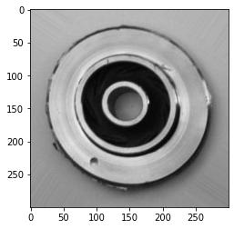
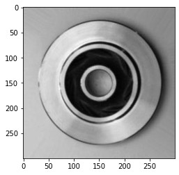
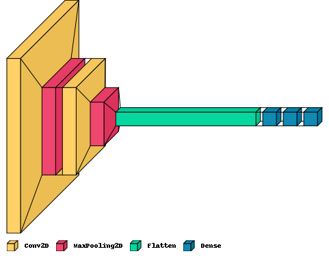
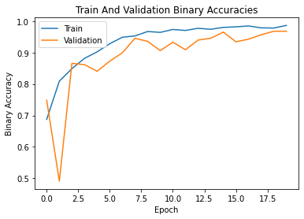
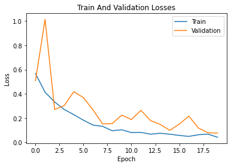

# Defective Pump Impeller Detection Using a CNN

This repository contains the files of my project for the Artificial Intelligence
course at Tehran Polytechnic.

## Project Description

This project is basically a classification problem. Since we are dealing with
images, we have decided to solve it with a convolutional neural network due to
its abilities in image processing.

## Dataset

The data we used are available on
[Kaggle](https://www.kaggle.com/ravirajsinh45/real-life-industrial-dataset-of-casting-product).

### Examples

#### Defective Pump Impeller

#### Non-Defective Pump Impeller

## The Convolutional Neural Network

We created a CNN with the following architecture:

- `Conv2D`: 64x64x8
- `MaxPool`: 32x32x8
- `Conv2D` 32x32x8
- `MaxPool`: 16x16x8
- `Flatten`: 2048
- `Dense`: 16
- `Dense`: 16
- `Dense`: 1

Total params: 33,737

## Training and Validation

### Accuracy

We used `binary_accuracy` as the performance metric of the network.

### Loss

We used `binary_crossentropy` as the loss function of the network.

## Results

Our CNN model can classify images of pump impeller with an accuracy of **~96%**.
